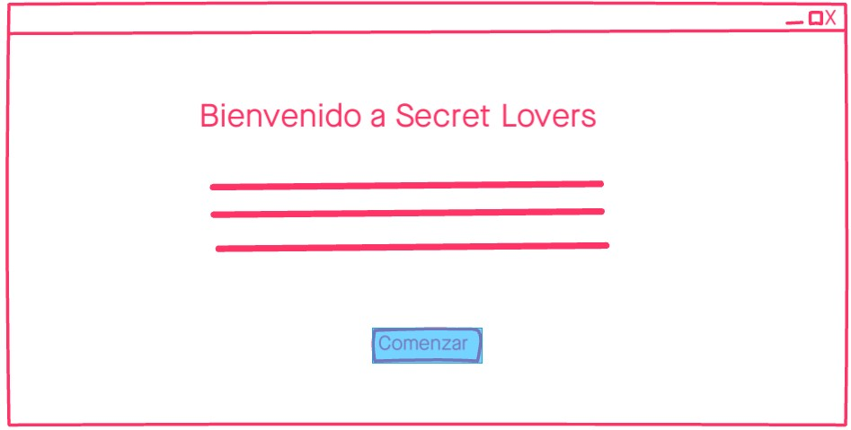
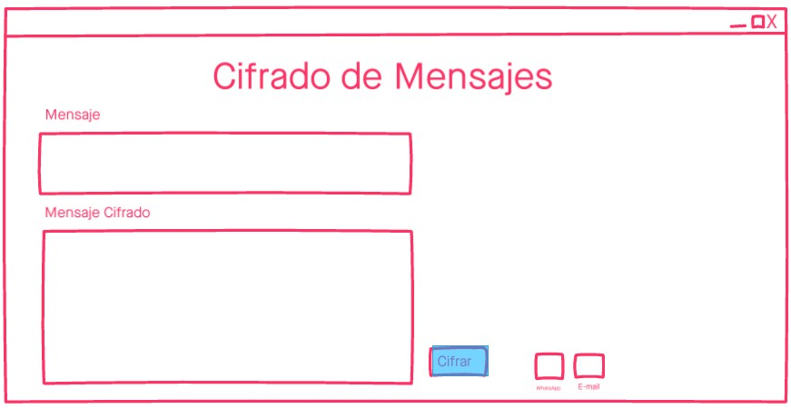
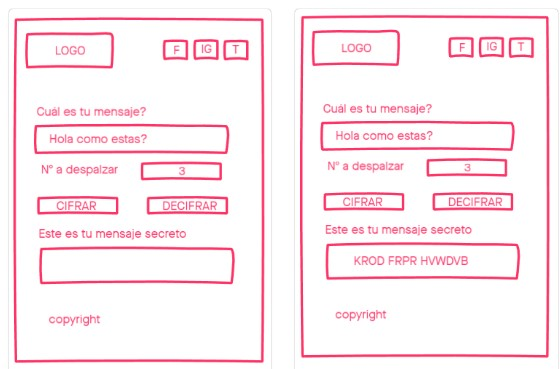
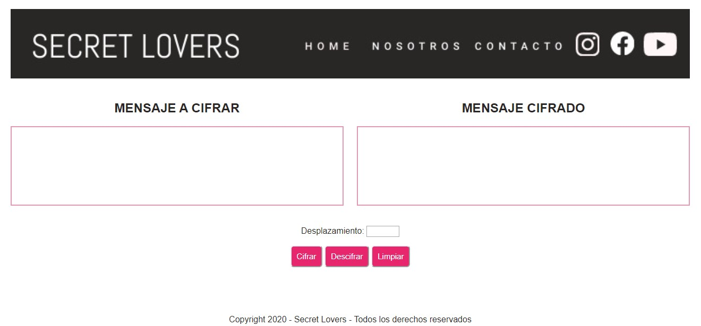
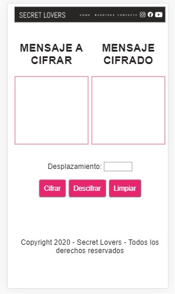

## Secret Lovers

Es una aplicación de mensajería secreta para enamorados, basada en la fórmula de encripción llamada Cifrado Cesar.  En Secret Lovers el usuario podrá escribir su mensaje, un número a elección y presionando los botones cifrar o descifrar  tendrá como respuesta su mensaje secreto . El número que elija el usuario es la clave para quien desee descifrar el mensaje, pueda hacerlo, de lo contrario, no podrá descubrir el mensaje original.

Se puede acceder a éste programa mediante el siguiente link: 

## Investigación de Mercado

Esta aplicación fue creada con la intención de mantener en reserva conversaciones. Los usuarios deberán escribir su mensaje, seleccionar un numero y cifrar su mensaje. De igual forma se podrá descifrar mensajes siempre y cuando se cuente con la clave (números de desplazamiento).

Los usuarios de Secret Lovers están en un rango de edad desde los 18 a 55 años, tanto hombres como mujeres, con conocimientos básicos de internet e hispanohablante. La app tiene un diseño intuitivo, que permite la interacción mediante iconos claros. 

En relación a colores, elegimos una gama de colores neutrales, nuestro publico objetivo son personas adultas, por eso nos hemos inclinado a colores como: negro, gris, blanco y fucsia el cual busca destacar ciertas acciones como los botones de Cifrar y Descifrar.

Secret Lovers busca mantener la discreción en conversaciones, de forma sencilla, rapida y secreta.

## Prototipos Iniciales

## Versión Desktop

## Versión Movil
            